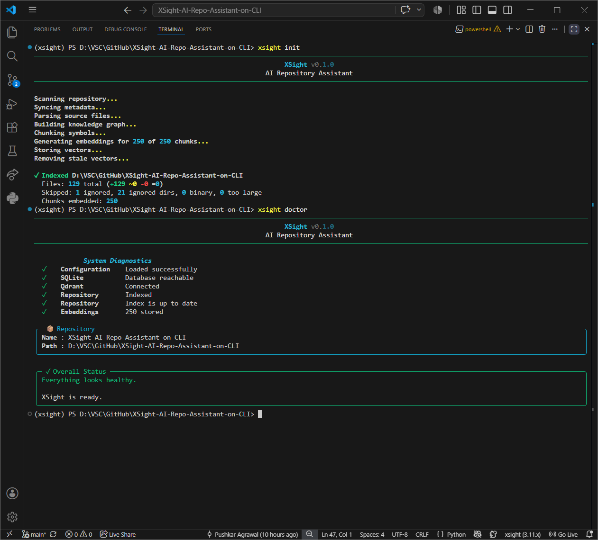
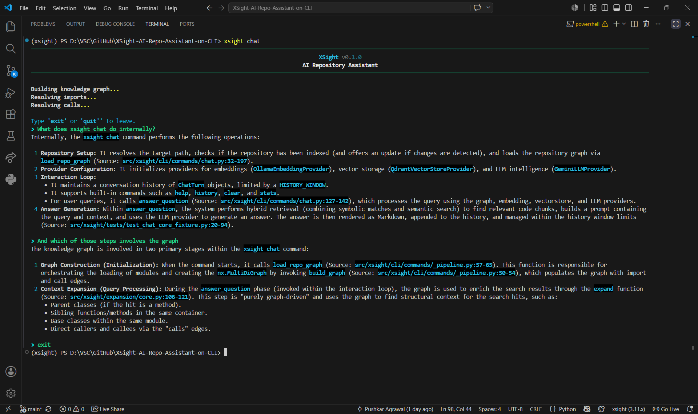
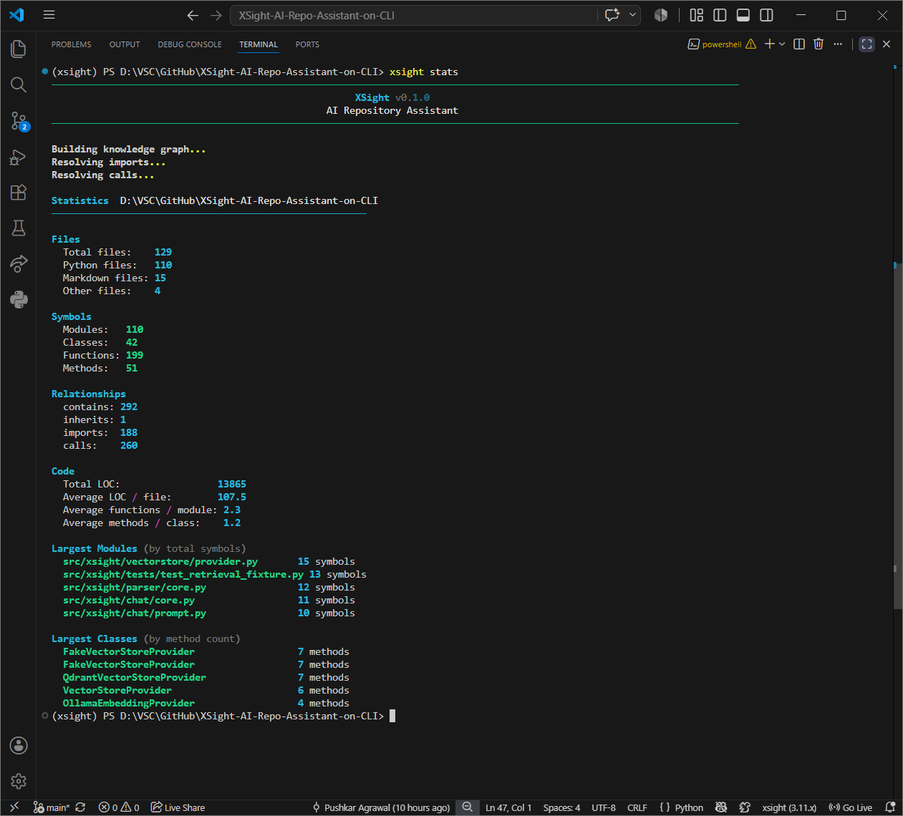
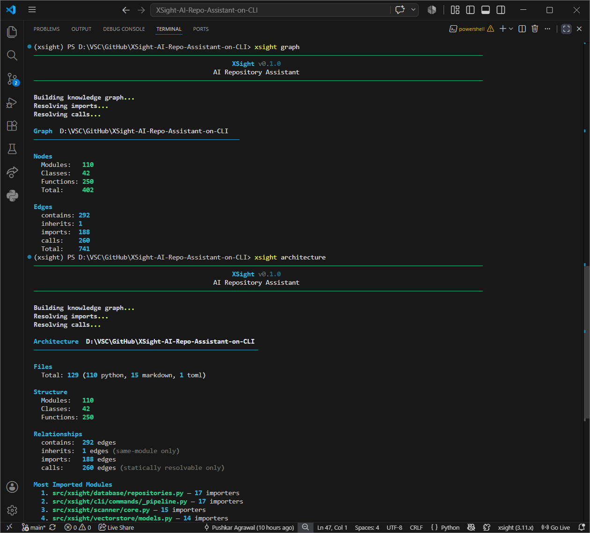
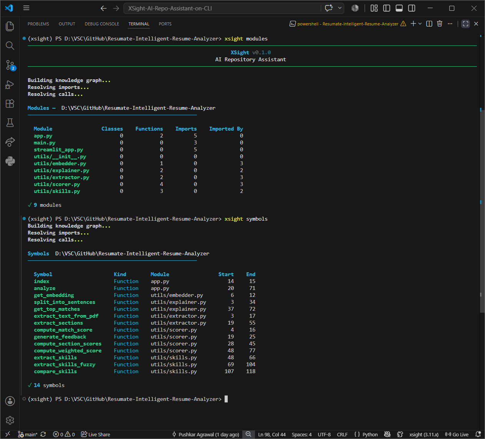
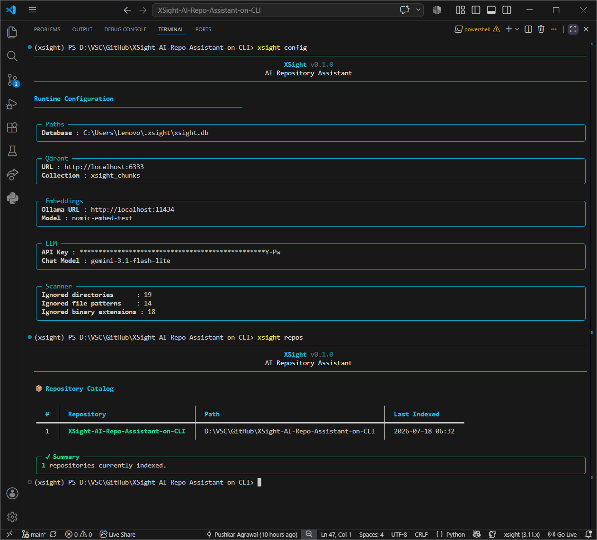
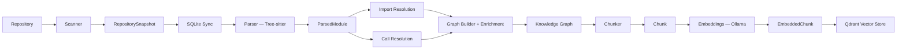
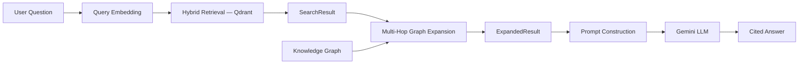
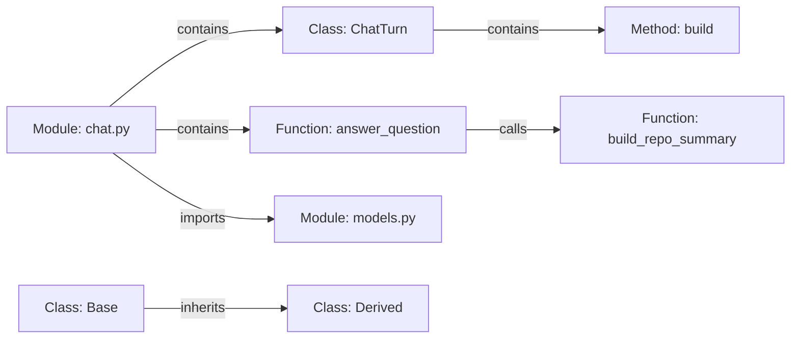

<div align="center">

# 🧠 XSight

**Agentic AI-powered Code Intelligence System using Graph RAG**

Understand any Python repository from the command line — not by chunking files and hoping semantic search finds the right one, but by building a structural knowledge graph of the codebase and reasoning over it.

[](https://www.python.org/)
[](https://typer.tiangolo.com/)
[](https://networkx.org/)
[](https://qdrant.tech/)
[](https://ollama.com/)
[](https://ai.google.dev/)
[]()

[Capabilities](#-capabilities--roadmap) • [Why XSight](#-why-xsight) • [Installation](#-installation) • [Quick Start](#-quick-start) • [CLI Commands](#-cli-commands) • [Architecture](#-architecture-overview)

</div>

---

## ✨ Short Description

XSight indexes a Python repository into a **knowledge graph** (modules, classes, functions, imports, calls) and a **vector store** of function/method embeddings. When you ask a question, it retrieves semantically relevant symbols, expands them structurally using the graph (multi-hop — parents, siblings, base classes, callers, callees), and hands the assembled context to an LLM — so answers are grounded in how your code actually connects, not just how it reads, and are cited back to the symbols they came from.

It is a CLI tool, not a chatbot bolted onto file search.

---

<p align="center">
  <br>
  <sub><b>Indexing a repository, then verifying system health</b></sub>
</p>

<p align="center">
  <br>
  <sub><b>Asking questions with multi-hop graph expansion and cited answers</b></sub>
</p>

<p align="center">
  <br>
  <sub><b>Repository statistics dashboard</b></sub>
</p>

<p align="center">
  <br>
  <sub><b>Raw knowledge graph inspection and High-level structural overview of the repository</b></sub>
</p>

<p align="center">
  <br>
  <sub><b>Module-level dependency and symbol breakdown</b></sub>
</p>

<p align="center">
  <br>
  <sub><b>Effective configuration and indexed repositories</b></sub>
</p>

---

## 🚀 Capabilities & Roadmap

| Capability | Status |
|---|---|
| Repository scanning (ignore rules, hashing, language detection) | ✅ Done |
| Tree-sitter Python parsing (classes, functions, methods, imports, calls) | ✅ Done |
| Deterministic symbol identity (stable IDs across re-indexing) | ✅ Done |
| Knowledge graph construction (`contains`, `inherits`) | ✅ Done |
| Import resolution → `imports` edges | ✅ Done |
| Call resolution → `calls` edges (static cases only) | ✅ Done |
| Incremental indexing (`xsight update` — only changed files re-parsed/re-embedded) | ✅ Done |
| Parsed-module caching for fast incremental re-processing | ✅ Done |
| Function/method-level semantic chunking | ✅ Done |
| Embeddings via Ollama + vector storage/search via Qdrant | ✅ Done |
| **Multi-hop** graph expansion (parents, siblings, base classes, callers, callees) | ✅ Done |
| **Hybrid retrieval with answer citations** back to source symbols | ✅ Done |
| Repository summary injected into chat context | ✅ Done |
| Conversational chat: history, built-in commands, auto freshness checks | ✅ Done |
| Repository exploration (`architecture`, `stats`, `modules`, `symbols`, `dependencies`, `graph`) | ✅ Done |
| Multi-repository management (`repos`, `remove`) + diagnostics (`doctor`) | ✅ Done |
| Cross-module inheritance resolution | ⏳ Planned |
| File watching / automatic re-indexing | ⏳ Planned |
| Git-aware updates | ⏳ Planned |
| Reranking of retrieval results | ⏳ Planned |
| Class-level / module-level semantic chunks | ⏳ Planned |
| Multi-language support (beyond Python) | ⏳ Planned |
| Multi-agent reasoning, bug investigation, IDE/CI integration | ⏳ Long-term |

---

## 🤔 Why XSight?

Most "chat with your codebase" tools work like this:

```
File → chunk → embed → retrieve top-k by cosine similarity → stuff into a prompt
```

This finds text that *sounds* relevant. It has no idea that the function it retrieved calls three other functions, is a method of a class with two subclasses, or lives in a module imported by three different parts of the system.

XSight instead builds an explicit **graph of your repository's real structure** — parsed by Tree-sitter, not guessed by an LLM — and uses it in two places:

1. **At index time**, to know how symbols actually relate (`contains`, `inherits`, `imports`, `calls`).
2. **At query time**, to expand a semantic search hit with its real structural neighborhood before ever calling an LLM.

If a relationship can't be determined with certainty (an ambiguous import, an unresolved call, a dynamic dispatch), XSight **skips it rather than guessing**. Wrong structural information is worse than missing information.

---

## 🏗️ Architecture Overview

XSight is a pipeline of independent, single-responsibility subsystems. Each stage consumes one repository-defined model and produces the next.





**Persistent state:** repository/file metadata (SQLite), semantic vectors (Qdrant).
**Transient state:** the knowledge graph, parsed modules, chunks, prompts — all rebuilt on demand, never persisted directly. Parsed modules are cached in SQLite as a performance optimization for incremental re-parsing, but the graph itself is always rebuilt.

---

## ⚙️ How It Works

### Indexing (`xsight init` / `xsight update`)

1. **Scan** — walk the repository, apply ignore rules, hash files, detect language.
2. **Sync** — diff the scan against SQLite metadata (added / updated / removed / unchanged).
3. **Parse** — Tree-sitter extracts classes, functions, methods, imports, and call sites into a `ParsedModule`. Only changed files are re-parsed; unchanged modules are loaded from a SQLite-backed cache.
4. **Resolve imports** — turn raw import statements into concrete module-to-module `ImportEdge`s. Ambiguous or unresolved imports are skipped, never guessed.
5. **Resolve calls** — turn call sites into caller→callee `CallEdge`s for same-module calls, `self.method()` calls, and supported cross-module calls through resolved imports.
6. **Build & enrich the graph** — construct module/class/function nodes and `contains`/`inherits` edges, then write in the resolved `imports` and `calls` edges.
7. **Chunk** — every function/method node becomes one embeddable chunk (prefixed with its name and module, followed by its exact source).
8. **Embed** — only chunks belonging to added/updated files are sent to Ollama for embedding.
9. **Store** — vectors are upserted into Qdrant with deterministic point IDs; vectors for removed symbols are deleted (stale-vector cleanup via ID set-diff).

### Querying (`xsight chat`)

1. The repository is re-parsed (using the same incremental cache) and the graph rebuilt fresh for the query.
2. The question is embedded and matched against stored vectors in Qdrant using hybrid retrieval (`SearchResult`).
3. Each hit is expanded using **multi-hop** graph traversal: parent class, base class, sibling symbols, callers, and callees (`ExpandedResult`) — expansion only follows edges that exist; it never infers.
4. Expanded results plus a repository summary and recent conversation history are formatted into a prompt.
5. Gemini generates the answer, rendered as markdown in the terminal with citations back to the source symbols it drew from.

---

## 📦 Installation

**Requirements:**
- Python ≥ 3.11
- [Ollama](https://ollama.com/) running locally, with the `nomic-embed-text` model pulled
- [Qdrant](https://qdrant.tech/) running locally (or reachable at a configured URL)
- A [Gemini API key](https://ai.google.dev/)

```bash
# Clone the repository
git clone https://github.com/PushkarAgrawal17/XSight-AI-Repo-Assistant-on-CLI.git
cd XSight-AI-Repo-Assistant-on-CLI

# Install with uv (recommended)
uv sync

# Or install in editable mode with pip
pip install -e .
```

Start the required services:

```bash
# Pull and serve the embedding model
ollama pull nomic-embed-text
ollama serve

# Run Qdrant (via Docker)
docker run -p 6333:6333 -p 6334:6334 qdrant/qdrant
```

Configure your Gemini API key (see [Configuration](#-configuration)):

```bash
echo "XSIGHT_GEMINI_API_KEY=your-key-here" > .env
```

Verify everything is wired up correctly:

```bash
xsight doctor
```

---

## 🏁 Quick Start

```bash
# Index a repository (run once)
xsight init /path/to/your/repo

# Explore what XSight understood
xsight architecture /path/to/your/repo
xsight stats /path/to/your/repo

# Ask questions about it
xsight chat /path/to/your/repo

# After making code changes, keep the index fresh
xsight update /path/to/your/repo
```

---

## 🖥️ CLI Commands

All commands accept a `path` argument defaulting to the current directory (`.`).

<details>
<summary><b>Repository Management</b></summary>

### `xsight init [path]`
Indexes a repository end-to-end: scan → parse → resolve imports/calls → build graph → chunk → embed → store in Qdrant. Run once per repository.

```bash
xsight init .
xsight init /path/to/repo
```

### `xsight update [path]`
Re-indexes an already-initialized repository **incrementally** — only added/changed files are re-parsed and re-embedded; vectors for removed symbols are deleted. Fails if the repository was never `init`-ed.

```bash
xsight update .
```

### `xsight repos`
Lists every repository XSight currently has indexed (name, path, last-indexed timestamp), read from the global SQLite database.

```bash
xsight repos
```

### `xsight remove [path]`
Permanently deletes a repository's XSight-owned data — vector entries, parsed-module cache, file metadata, and the repository record. **Never touches your source files.** Prompts for confirmation.

```bash
xsight remove /path/to/repo
```

</details>

<details>
<summary><b>Repository Exploration</b> (read-only — never re-embeds, never contacts the LLM)</summary>

All exploration commands check whether the on-disk repository has changed since the last index and will tell you to run `xsight update` first if it's stale.

### `xsight architecture [path]`
High-level structural overview: file/language breakdown, module/class/function counts, edge counts by relationship type, and the most-imported modules in the repo.

```bash
xsight architecture .
```

### `xsight stats [path]`
A numeric dashboard: file counts by type, symbol counts (modules/classes/functions/methods), relationship counts, total/average LOC, and the largest modules (by symbol count) and classes (by method count).

```bash
xsight stats .
```

### `xsight modules [path]`
Table of every module with its class count, function count, and import fan-in/fan-out.

```bash
xsight modules .
```

### `xsight symbols [path]`
Flat listing of every class, function, and method in the repository, with owning module and source line range.

```bash
xsight symbols .
```

### `xsight dependencies [path] [module]`
Without `module`: a table of every module's import/imported-by counts.
With `module` (a graph node's relative path, e.g. `src/xsight/parser/core.py`): one-hop import neighbors in both directions.

```bash
xsight dependencies .
xsight dependencies . src/xsight/parser/core.py
```

### `xsight graph [path] [node]`
Raw inspector over the in-memory knowledge graph. Without `node`: node/edge counts by type. With an exact graph node ID: its attributes plus all incoming/outgoing edges grouped by relationship type.

```bash
xsight graph .
xsight graph . "src/xsight/parser/core.py::parse"
```

</details>

<details>
<summary><b>AI</b></summary>

### `xsight chat [query] [path]`
Ask natural-language questions about the repository. With `query`: answers once and exits. Without it: enters an interactive session with in-session commands (`help`, `history`, `clear`, `stats`, `exit`/`quit`). Automatically detects if the repo has changed and offers to run `xsight update` first.

```bash
xsight chat "How does the incremental indexing pipeline work?" .
xsight chat .   # interactive mode
```

</details>

<details>
<summary><b>Utilities</b></summary>

### `xsight doctor [path]`
System diagnostics: configuration load, SQLite reachability, Qdrant connectivity, repository indexed/stale status, and stored embedding count. Reports overall health with clear next steps.

```bash
xsight doctor .
```

### `xsight config`
Read-only display of the effective runtime configuration (paths, Qdrant, embeddings, LLM settings), grouped by section. Sensitive values (API keys) are automatically masked.

```bash
xsight config
```

### `xsight version`
Prints the installed XSight version, Python version, platform, and install path.

```bash
xsight version
```

### `xsight help`
Curated CLI landing page listing all commands by category with quick-start examples.

```bash
xsight help
```

</details>

---

## 💬 Example Usage

```bash
$ xsight init .
────────────────────────────────────────────
              XSight v0.1.0
          AI Repository Assistant
────────────────────────────────────────────

Scanning repository...
Syncing metadata...
Parsing source files...
Building knowledge graph...
Chunking symbols...
Generating embeddings for 92 of 92 chunks...
Storing vectors...
Removing stale vectors...

✓ Indexed /path/to/repo
  Files: 50 total (+50 ~0 -0 =0)
  Skipped: 4 ignored, 2 ignored dirs, 1 binary, 0 too large
  Chunks embedded: 92
```

```bash
$ xsight chat "What does the graph enrichment stage do?" .
...
The graph enrichment stage takes the resolved ImportEdge and CallEdge
objects — produced separately by import resolution and call resolution —
and writes them into the knowledge graph as `imports` and `calls` edges...
```

```bash
$ xsight dependencies . src/xsight/graph/builder.py
Module  src/xsight/graph/builder.py

Imports
──────────────────────────────
  → src/xsight/parser/models.py

Imported By
──────────────────────────────
  ← src/xsight/cli/commands/_pipeline.py
```

---

## 📁 Project Structure

```
src/xsight/
├── cli/
│   ├── main.py                 # Typer app + command registration
│   └── commands/
│       ├── _pipeline.py        # Shared incremental indexing pipeline (init/update/exploration)
│       ├── init.py             # `xsight init`
│       ├── update.py           # `xsight update`
│       ├── chat.py             # `xsight chat`
│       ├── architecture.py     # `xsight architecture`
│       ├── stats.py            # `xsight stats`
│       ├── modules.py          # `xsight modules`
│       ├── symbols.py          # `xsight symbols`
│       ├── dependencies.py     # `xsight dependencies`
│       ├── graph.py            # `xsight graph`
│       ├── repos.py            # `xsight repos`
│       ├── remove.py           # `xsight remove`
│       ├── doctor.py           # `xsight doctor`
│       ├── config.py           # `xsight config`
│       ├── version.py          # `xsight version`
│       └── help.py             # `xsight help`
├── config/                     # Settings, ignore rules, language mapping
├── database/                   # SQLite connection, schema, repository/module CRUD
├── scanner/                    # Filesystem discovery, hashing, language detection
├── indexer/                    # Diff-based SQLite sync
├── parser/                     # Tree-sitter parsing → ParsedModule IR
├── imports/                    # Import resolution → ImportEdge
├── calls/                      # Call resolution → CallEdge
├── graph/                      # Graph construction + enrichment (NetworkX MultiDiGraph)
├── chunker/                    # Graph symbols → embeddable Chunk objects
├── embeddings/                 # Embedding orchestration + Ollama provider
├── vectorstore/                # Qdrant orchestration + provider
├── chat/                       # Retrieval, graph expansion, prompt construction
└── llm/                        # Gemini provider
```

---

## 🧰 Tech Stack

| Layer | Technology |
|---|---|
| CLI framework | [Typer](https://typer.tiangolo.com/) + [Rich](https://rich.readthedocs.io/) |
| Interactive prompt | [prompt_toolkit](https://python-prompt-toolkit.readthedocs.io/) |
| Parsing | [Tree-sitter](https://tree-sitter.github.io/tree-sitter/) (`tree-sitter-python`) |
| Knowledge graph | [NetworkX](https://networkx.org/) (`MultiDiGraph`) |
| Metadata persistence | SQLite (raw `sqlite3`, no ORM) |
| Embeddings | [Ollama](https://ollama.com/) (`nomic-embed-text`) |
| Vector database | [Qdrant](https://qdrant.tech/) |
| LLM | [Google Gemini](https://ai.google.dev/) (`gemini-3.1-flash-lite` by default) |
| Configuration | [Pydantic Settings](https://docs.pydantic.dev/latest/concepts/pydantic_settings/) |
| Package management | [uv](https://docs.astral.sh/uv/) |

---

## 🔍 How Repository Indexing Works

Indexing is **incremental by design**. Every run — whether `xsight init` or `xsight update` — diffs the current filesystem state against SQLite-stored file hashes:

- **Added/changed files** are re-parsed with Tree-sitter and re-embedded.
- **Unchanged files** have their parsed module loaded from a SQLite-backed JSON cache instead of being re-parsed.
- **Removed files** have their cached parsed modules deleted, and their vectors are removed from Qdrant via a set-diff between expected point IDs and what's actually stored.

This means `xsight update` on a large repository with a handful of changed files is fast — it doesn't re-embed the entire codebase.

---

## 🕸️ Graph RAG Pipeline

The knowledge graph is a `networkx.MultiDiGraph` with:

**Node kinds:** `module`, `class`, `function` (methods are function nodes with `is_method=True` and a `parent_id`)

**Edge types:**
| Edge | Meaning | Scope |
|---|---|---|
| `contains` | module→class, module→function, class→method | Always explicit at every level |
| `inherits` | subclass → base class | Same-module only (unresolved cross-module bases are skipped, not guessed) |
| `imports` | module → module | Repository-wide, via deterministic import resolution |
| `calls` | function/method → function/method | Same-module, `self.method()`, and supported cross-module calls through resolved imports |

Node attributes are flattened primitives (`kind`, `name`, `start_line`, etc.) — never embedded parser objects — so the graph is self-contained and doesn't leak implementation details to downstream consumers like the chunker or the chat expansion stage.

---

## 🔎 Vector Search Pipeline

- Every function/method node becomes exactly one `Chunk`: a short prefix (`Function: name` / `Method: Class.name`, plus module path) followed by the symbol's exact source, reread from disk.
- Chunks are embedded via Ollama (768-dimensional `nomic-embed-text` vectors) and stored in a **single global Qdrant collection**, filtered by `repo_id` in the payload — not one collection per repository.
- Point IDs are deterministic UUID5s derived from `(repo_id, chunk_id)`, so re-indexing overwrites rather than duplicates.
- At query time, the question is embedded with the same provider and matched via Qdrant similarity search, returning ordered `SearchResult`s.

Class-level and module-level chunks are **not yet implemented** — only functions and methods are directly searchable. A class is reachable only by retrieving one of its methods and expanding via the graph.

---

## 🕸️ Repository Graph



This structure is what powers `xsight architecture`, `xsight dependencies`, `xsight graph`, and the graph-expansion step inside `xsight chat`.

---

## ⚙️ Configuration

XSight is configured via environment variables (prefixed `XSIGHT_`) or a `.env` file in the project root, loaded through Pydantic Settings.

```bash
# .env
XSIGHT_GEMINI_API_KEY=your-gemini-api-key
```

| Variable | Default | Purpose |
|---|---|---|
| `XSIGHT_DB_PATH` | `~/.xsight/xsight.db` | Global SQLite database location |
| `XSIGHT_OLLAMA_BASE_URL` | `http://localhost:11434` | Ollama server URL |
| `XSIGHT_EMBEDDING_MODEL` | `nomic-embed-text` | Embedding model name |
| `XSIGHT_QDRANT_URL` | `http://localhost:6333` | Qdrant server URL |
| `XSIGHT_QDRANT_COLLECTION` | `xsight_chunks` | Qdrant collection name |
| `XSIGHT_GEMINI_API_KEY` | _(none — required for `chat`)_ | Gemini API key |
| `XSIGHT_GEMINI_MODEL` | `gemini-3.1-flash-lite` | Gemini model name |

Run `xsight config` at any time to see the effective, resolved configuration (secrets are automatically masked).

---

## 🛠️ Development Setup

```bash
git clone https://github.com/PushkarAgrawal17/XSight-AI-Repo-Assistant-on-CLI.git
cd XSight-AI-Repo-Assistant-on-CLI
uv sync
```

XSight indexes itself — a good first sanity check after any change:

```bash
xsight init .
xsight architecture .
xsight chat "Explain the call resolution subsystem" .
```

The project follows strict conventions documented internally: one responsibility per subsystem, repository-defined dataclasses (not raw dicts) as cross-subsystem contracts, "skip rather than guess" for any ambiguous static analysis, and fail-loudly error handling (friendly messages are a CLI-layer-only concern; internal subsystems never silently recover).

---

## 🤝 Contributing

This is currently a solo learning/portfolio project under active development. Issues and suggestions are welcome via GitHub. If you'd like to contribute code, please open an issue first to discuss the change — the project follows a design-before-implementation workflow (architecture is finalized and fixture tests are written before any implementation code).

---

## 🙏 Acknowledgements

Built on top of [Tree-sitter](https://tree-sitter.github.io/tree-sitter/), [NetworkX](https://networkx.org/), [Qdrant](https://qdrant.tech/), [Ollama](https://ollama.com/), and [Google Gemini](https://ai.google.dev/).

---

## Author

**Pushkar Agrawal**

[GitHub](https://github.com/PushkarAgrawal17) · [LinkedIn](https://linkedin.com/in/pushkaragrawal17)


<div align="center">

**[⬆ Back to top](#-xsight)**

</div>
